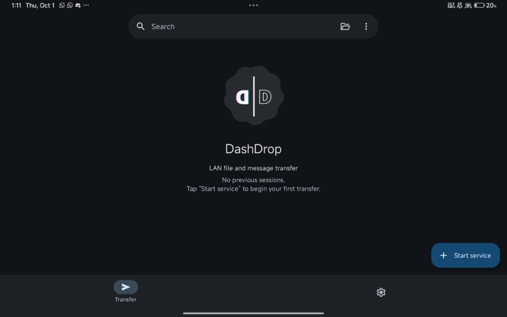
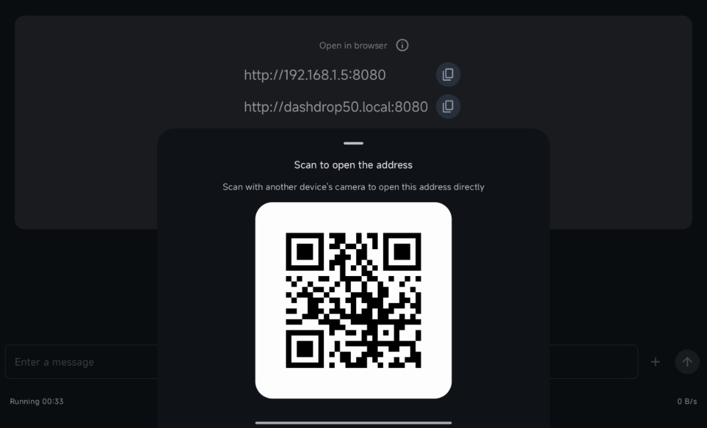
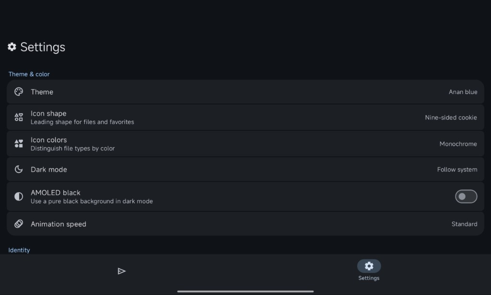
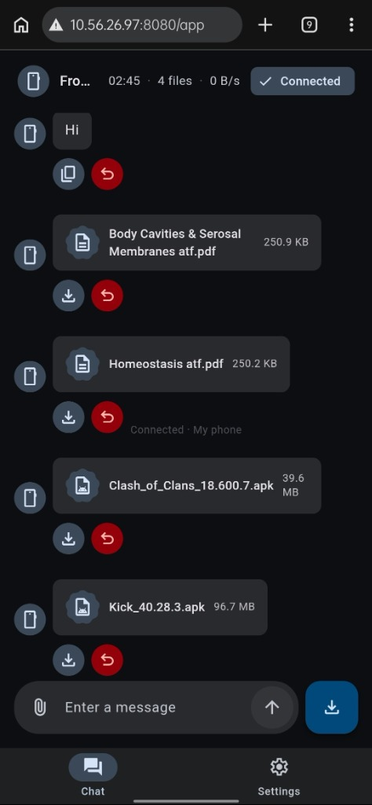

<p align="center">
  
</p>

<h1 align="center">DashDrop</h1>

<p align="center">
  <strong>Fast, effortless local-network file and message sharing between Android and any web browser.</strong>
</p>

<p align="center">
  <a href="https://github.com/LeoAristocrat/DashDrop/releases/tag/v1.0.0"></a>
  <a href="https://developer.android.com"></a>
  <a href="https://kotlinlang.org"></a>
  <a href="./LICENSE"></a>
</p>

<p align="center">
  <strong>Developed and Maintained by Sayeem Sadik / Leo Aristocrat</strong><br>
  🌐 <a href="https://leoaristocrat.eu.cc/">https://leoaristocrat.eu.cc/</a> &nbsp;|&nbsp; 🐙 <a href="https://github.com/LeoAristocrat/DashDrop">GitHub Repository</a>
</p>

---

## ⚡ What is DashDrop?

**DashDrop** bridges your phone and computer without cables, extra apps, or third-party sign-ups. When started, DashDrop turns your Android device into a local transfer point. Any laptop, tablet, or phone on the same Wi-Fi can open the provided web address or scan the QR code to immediately swap files, paste text, share photos, and send APKs back and forth at full LAN speed.

* **No setup on receiver:** Open Chrome, Safari, Firefox, or Edge on any computer or mobile device.
* **Direct LAN performance:** Transfers fly over your local router or mobile hotspot.
* **Private by default:** Everything stays on your local network.

---

## 📸 Interface & Screenshots

<table align="center" width="100%">
  <tr>
    <td align="center" width="50%">
      <strong>Main Dashboard</strong><br>
      
      <br><em>Minimalist home hub with one-tap transfer start</em>
    </td>
    <td align="center" width="50%">
      <strong>Quick Pairing & mDNS</strong><br>
      
      <br><em>Easy mDNS address (`dashdrop{N}.local`) and instant QR pairing</em>
    </td>
  </tr>
  <tr>
    <td align="center" width="50%">
      <strong>Custom Themes & Colors</strong><br>
      
      <br><em>Catppuccin Mocha, Hacker, AMOLED Black & dynamic palettes</em>
    </td>
    <td align="center" width="50%">
      <strong>Live Web Client</strong><br>
      
      <br><em>Clean, chat-style browser interface for instant two-way drops</em>
    </td>
  </tr>
</table>

---

## 🌟 Highlights

### 💬 Chat-Style Two-Way Transfers
* Exchange documents, high-res photos, videos, clipboard text, links, and APK files in a familiar message-thread layout.
* Drag and drop files directly onto the browser window.
* Monitor real-time progress bars, throughput speeds, and completion indicators driven by WebSockets.

### 🔗 Frictionless Local Connectivity
* **Friendly Local URLs:** Computer browsers can connect directly to `http://dashdrop{N}.local:port` without memorizing changing IP addresses.
* **Instant QR Code Scan:** Mobile browsers can pair immediately by scanning the screen.
* **Hotspot Friendly:** Fully functional over Wi-Fi networks as well as Android portable hotspots.

### 🎨 Material 3 Expressive Customization
* Choose between vibrant color schemes, including **Catppuccin Mocha**, **Hacker** (cyber green), **Anan Blue**, and system Material You themes.
* True **AMOLED Black** mode for pure blacks and power saving on OLED screens.
* Fine-tune animation speeds and custom shape tokens (cookie shapes, squircle, standard curves).

### 📁 Media & Storage Explorer
* **Send Installed APKs:** Easily extract and share any installed application (`App_Version.apk`) with one click.
* **Photo & Album Browser:** Select and download photos organized by date or album.
* **Ammo Box (Favorites):** Save recurring text snippets or important files into your persistent Favorites for quick access anytime.

### 🛡️ Local Security Built-In
* Protected with a customizable 6-digit PIN by default.
* Host validation prevents cross-site request forgery and DNS rebinding attacks.
* The browser application is bundled right inside the APK—no external CDNs or remote dependencies are contacted.

---

## 🚀 How to Use

1. **Start the Service:** Open DashDrop on your phone and tap **Start service**.
2. **Access the URL:** On your computer or tablet, navigate to either the IP address or the `http://dashdrop{N}.local` link shown on your screen (or scan the QR code).
3. **Enter PIN:** Provide the on-screen 6-digit PIN if prompted.
4. **Drop & Receive:** Drag files into the browser, type messages, or select files and APKs on your phone to transfer instantly.

---

## 🛠️ Building & Developing

### Requirements
* **Android Studio Ladybug** (or later)
* **JDK 17** or **JDK 21**
* **Android SDK Platform 37** (minSdk 33, targetSdk 36)

### Build Commands

```bash
# Clone the repository
git clone https://github.com/LeoAristocrat/DashDrop.git
cd DashDrop

# Run JVM Unit Tests
./gradlew testDebugUnitTest

# Assemble Debug APK
./gradlew assembleDebug

# Assemble Production Signed Release APK
./gradlew assembleRelease
```

On Windows (PowerShell):
```powershell
.\gradlew.bat testDebugUnitTest
.\gradlew.bat assembleDebug
.\gradlew.bat assembleRelease
```

Generated APKs can be found in `app/build/outputs/apk/release/` and `app/build/outputs/apk/debug/`.

---

## 🏛️ System Architecture

```text
DashDrop (com.leoaristocrat.dashdrop)
├── ui/              ── Jetpack Compose UI (Material 3 Expressive, Themes, Settings)
├── service/         ── Foreground service management, Wi-Fi locks, background tasks
├── server/          ── Embedded Ktor CIO HTTP & WebSocket local transfer engine
├── session/         ── Active message pipeline, transfer tracking, session state
├── data/            ── Room database (DashDropDatabase), preferences & file stores
├── network/         ── Local IP discovery and mDNS broadcast responder
└── assets/web/      ── Bundled standalone web application
```

---

## 👥 Authors & Maintainers

DashDrop is developed and maintained by:

* **Sayeem Sadik / Leo Aristocrat**
  * Website: [https://leoaristocrat.eu.cc/](https://leoaristocrat.eu.cc/)
  * GitHub: [@LeoAristocrat](https://github.com/LeoAristocrat)
  * Repository: [https://github.com/LeoAristocrat/DashDrop](https://github.com/LeoAristocrat/DashDrop)

---

## 📄 License

This project is licensed under the **MIT License** — see the [LICENSE](./LICENSE) file for details.
