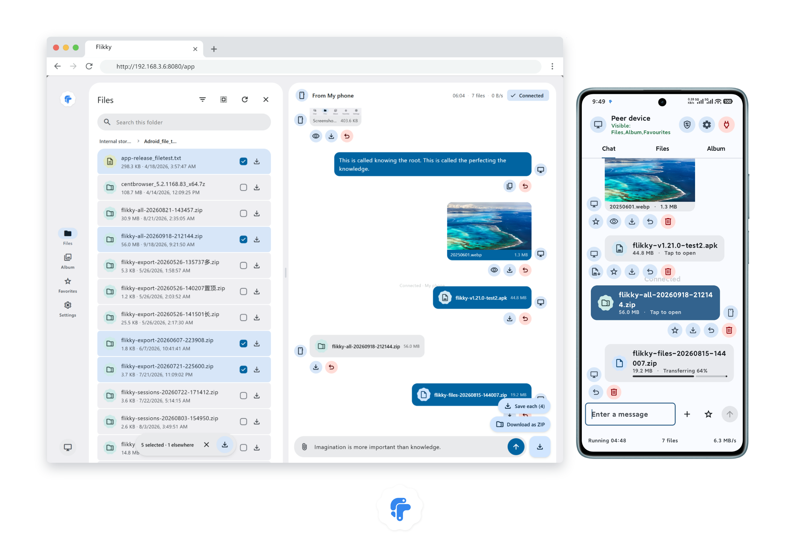
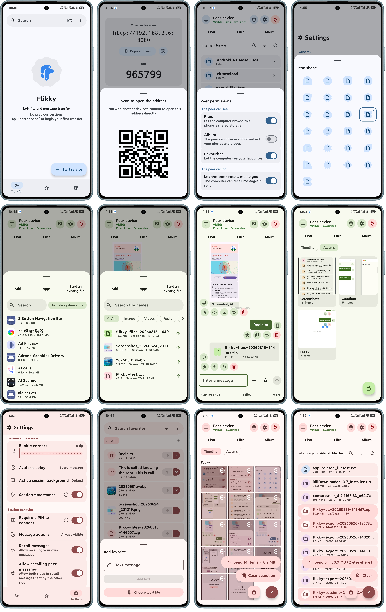
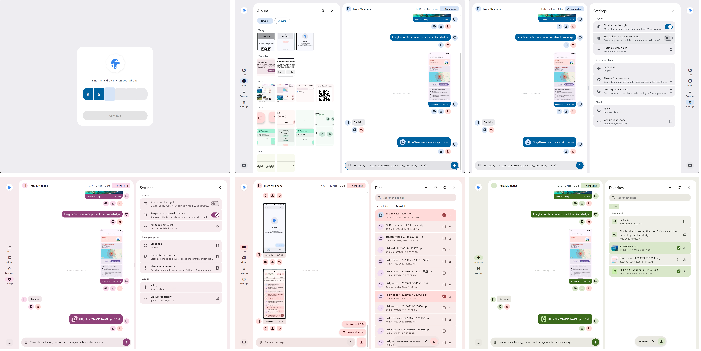

<p align="center">
  
</p>

<h1 align="center">DashDrop</h1>

<p align="center">
  <em>"Fast, local-network file and message transfer just like chatting"</em>
</p>

<p align="center">
  Account-free LAN transfer between an Android phone and any modern browser.
</p>

<p align="center">
  <strong>Developed and Maintained by Sayeem Sadik / Leo Aristocrat</strong><br>
  Website: <a href="https://leoaristocrat.eu.cc/">https://leoaristocrat.eu.cc/</a> · GitHub: <a href="https://github.com/LeoAristocrat/DashDrop">https://github.com/LeoAristocrat/DashDrop</a>
</p>

---

DashDrop turns an Android phone into a short-lived local transfer server. A browser on the same Wi-Fi opens the address shown by the app and can exchange text and files in real time. The browser side needs no app, extension, account, cloud service, or internet connection.

DashDrop is designed for trusted local networks and keeps the operational complexity on the phone: pairing, session state, history, favorites, backup, and recovery all live in the Android app.

Favorites (Ammo Box): You can turn **any message or local file** into a favorite. If it's a file, it will be **stored independently**, so deleting it externally won't affect the favorite. Your favorites are always ready when you need to send them.

## Status

| Channel | Revision | State |
| --- | --- | --- |
| Stable source | [`v1.0.0`](https://github.com/LeoAristocrat/DashDrop/tree/v1.0.0) | The phone gets a memorable `dashdrop{N}.local` address next to its IP, with a number and port you choose; the browser can favorite session messages to the phone and sees which ones it already keeps; and the server now answers only to its own host names and refuses cross-origin writes. |
| `main` | [Repository](https://github.com/LeoAristocrat/DashDrop) | Active development branch. |

Per-release changes are documented in the [changelog](./docs/CHANGELOG.md); version history is available from the repository's [tags](https://github.com/LeoAristocrat/DashDrop/tags).

## Screenshots



### App



### Browser



### Mobile browser


## Using DashDrop

1. Install DashDrop on a phone running Android 13 or newer.
2. Connect the phone and the receiving device to the same Wi-Fi network.
3. Start the transfer service in DashDrop. The app shows two local URLs — the IP address and a memorable `dashdrop{N}.local` name — and, by default, a one-time six-digit PIN (configurable in Settings).
4. Open either URL in a computer browser, or scan the QR code with another phone (Android cannot resolve `.local` names natively), and enter the PIN when prompted (if one is required).
5. Send text or files in either direction. Progress, connection state, and failures update in real time.
6. Stop the service when finished. The completed session remains available in History according to the configured retention policy.

*Note: The network must allow device-to-device traffic. Guest Wi-Fi and access points with client isolation can block the connection even when both devices show the same network name.*

## Core Features

- **Two-way transfer:** Text and files move between Android and the browser over HTTP and WebSocket, with progress and failure states for both directions. The browser accepts drag-and-drop file uploads. Images and videos show proportional thumbnails in bubbles, with an in-app preview on Android and a fullscreen lightbox in the browser.
- **Session history:** Room-backed sessions support search, pin, rename, grouping, per-message actions, configurable retention, and crash recovery.
- **Recall and cleanup:** Messages can be recalled during an active session, optionally including the other end's messages; local history items and sessions can be deleted with confirmation or undo where appropriate. Deleting a file frees its on-disk copy while History keeps an inert record.
- **Files overview:** Browse files from all sessions in one place with direction/category filters, search, sorting, and multi-select actions (favorite, save, share, jump to message, delete).
- **Browse the phone's storage:** With the default-off switch on, the phone's own storage is browsable from the session screen's files tab and from the browser's files panel — breadcrumb navigation, in-folder search, sorting, thumbnails and preview for images and video, a batch download in the browser, and a multi-directory selection sent into the session from the phone. DashDrop only ever reads.
- **Browse the phone's album:** A timeline grouped by capture date or a grid of album folders, on both ends. Long-press and drag to select a range on the phone, pick tiles and batch-download in the browser. Uses Android's narrow media permissions, including Android 14+ "selected photos only", rather than All files access.
- **Send an installed app:** Search installed apps, and DashDrop extracts the chosen app's base APK and sends it into the session as `AppName_Version.apk`.
- **Peer permissions in one place:** A panel in the session header states each channel as unavailable, off, or on. Closing a channel also cuts a transfer already in flight.
- **QR code pairing:** A QR code button on the connection card opens a sheet with the code. It encodes only the URL — the single-use PIN stays on the phone screen.
- **Memorable LAN address:** Next to the IP, the connection card shows `http://dashdrop{N}.local:port`, which computer browsers open directly. DashDrop answers for that name itself with a minimal mDNS responder that runs only while the service does. Choose the number (0–999) and the port in Settings → Access address; if the port is busy the service moves to the next free one.
- **Favorites:** Keep independent text or file snapshots in collections, add local items without a session, search them, and send them back into an active transfer.
- **Portable archives:** Export sessions, favorites, settings, or all data to a ZIP archive (`dashdrop-*.zip`); save it on Android or serve it to a browser, then import it later. Backwards compatibility with legacy backups is fully preserved.
- **Adaptive appearance:** Material 3 Expressive themes, custom theme colors, dark mode, contrast, motion speed, avatars, bubble shape, and grouping stay aligned across phone and browser.
- **Multilingual:** Both the app and the browser client support Chinese and English, and the language setting stays in sync across both ends.
- **Offline browser client:** The HTML, CSS, JavaScript, mdui components, Material Symbols font, and design tokens are bundled directly in the APK; no external CDN is queried.

## Security & Privacy Model

- The server binds only to the concrete private IPv4 address of the active Wi-Fi network, or of the phone's own hotspot, never `0.0.0.0`, never a cellular or VPN interface, and does not depend on a cloud backend.
- PIN authentication is enabled by default. A PIN is single-use; three wrong attempts lock the source IP for 30 seconds and five wrong attempts stop the service.
- Browser responses use a strict CSP, `X-Frame-Options: DENY`, `X-Content-Type-Options: nosniff`, `Referrer-Policy: same-origin`, HttpOnly/SameSite cookies, `textContent` rendering, and short-lived Blob download URLs.
- **Only the phone's own host names are answered.** Every request's `Host` must be the bound IP and port or the `.local` name shown on the card; anything else gets `403`. State-changing requests and the WebSocket handshake must also be same-origin.
- The local-name responder is minimal and safe: its receive socket binds `224.0.0.251:5353` and its send socket the bound private IPv4, never `0.0.0.0`.
- The only network request outside the LAN is the optional update check, which fetches `https://api.github.com/repos/LeoAristocrat/DashDrop/releases/latest` over HTTPS only when triggered manually or explicitly enabled.

## Build from Source

### Prerequisites

- JDK 17 or JDK 21
- Android SDK Platform 37
- Android 13+ device or emulator

### Building with Gradle

```bash
# Build the debug APK and run JVM tests
./gradlew assembleDebug testDebugUnitTest

# Install on a connected device
./gradlew installDebug

# Run instrumented tests on a connected device/emulator
./gradlew connectedAndroidTest
```

On Windows PowerShell:

```powershell
.\gradlew.bat assembleDebug testDebugUnitTest
```

The debug APK is generated at:
`app/build/outputs/apk/debug/app-debug.apk`

### Running Browser Regression Tests

Browser regression checks run using Node.js without third-party packages:

```bash
# Run web client test suite
node scripts/test-web.mjs
```

## Architecture

```text
Android app (com.leoaristocrat.dashdrop)
├── Jetpack Compose UI (Material 3 Expressive)
├── TransferService (foreground-service lifecycle)
│   └── Ktor CIO server ── HTTP / WebSocket ── Browser client (bundled in assets)
├── Room Database + app-owned file stores (sessions and favorites)
└── DataStore Preferences (app & peer configuration)
```

| Path | Responsibility |
| --- | --- |
| `ui/` | Compose screens, ViewModels, shared components, and DashDrop themes |
| `service/` | Foreground service, transfer controller, and notifications |
| `server/` | Ktor server, routes, DTOs, authentication, and WebSocket hub |
| `session/` | In-memory session state and message models |
| `data/` | Room database (`DashDropDatabase`), repositories, file stores, and settings persistence |
| `export/` | ZIP schema, importer/exporter, snapshots, and file naming (`dashdrop-*.zip`) |
| `network/` | Wi-Fi IPv4 discovery, mDNS responder (`dashdrop{N}.local`), and update checker |
| `util/`, `di/` | Pure helpers and dependency wiring |
| `app/src/main/assets/web/` | Standalone browser application bundled into the APK |

The project intentionally remains a single Android `:app` module. Android-specific dependencies stay out of the server and pure-logic boundaries so core behavior remains testable on the JVM.

## Author & Maintainer

**DashDrop** is developed and maintained by **Sayeem Sadik / Leo Aristocrat**.
* Website: [https://leoaristocrat.eu.cc/](https://leoaristocrat.eu.cc/)
* GitHub: [https://github.com/LeoAristocrat/DashDrop](https://github.com/LeoAristocrat/DashDrop)

## Acknowledgements

- [Ktor](https://ktor.io/) for the embedded HTTP/WebSocket server
- [mdui](https://github.com/zdhxiong/mdui) for the offline-bundled Material Design 3 Web Components

## License

MIT License. See [LICENSE](./LICENSE).
